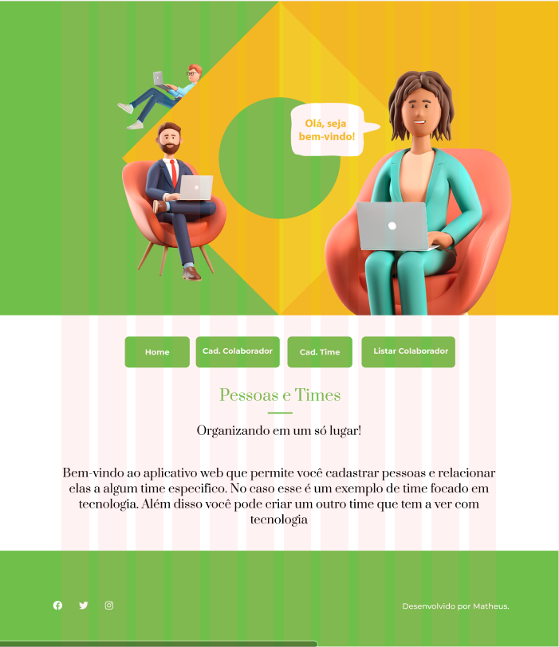

# MVP 2 - Desenvolvimento Front-end Avançado



---

## Front-End

O Produto Mínimo Viável / _Minimum Viable Product (MVP)_ envolve utilizar componentização com React e seus recursos como hooks, props e states, bem como simular chamadas a um servidor fazendo a leitura de um JSON. Foram utilizados HTML, CSS, JavaScript, Node.js e React.js.

### Figma

Projeto: [PUC-Rio figma](https://www.figma.com/file/h1o21EusrAQ7eVyvWnVPR3/Colaboradores-times?type=design&node-id=7%3A415&mode=design&t=l8H4mLClLh3NDWMi-1). Protótipo em alta-fidelidade de 3 páginas interativas.

---

### Instruções

Baixe e instale o ambiente de execução assíncrono e interpretador de JavaScript [Node.js](https://nodejs.org/en/download/). Instale as dependências/bibliotecas descritas no arquivo package.json utilizando o Node Package Manager (NPM), usando os comandos no terminal:

```PowerShell
## Instalação do NPM. A pasta node_modules será criada.
$ npm install

## Iniciação do NPM
$ npm start
```

Parar o NPM, pelo atalho de teclado, no VS Code:

> Ctrl + C
